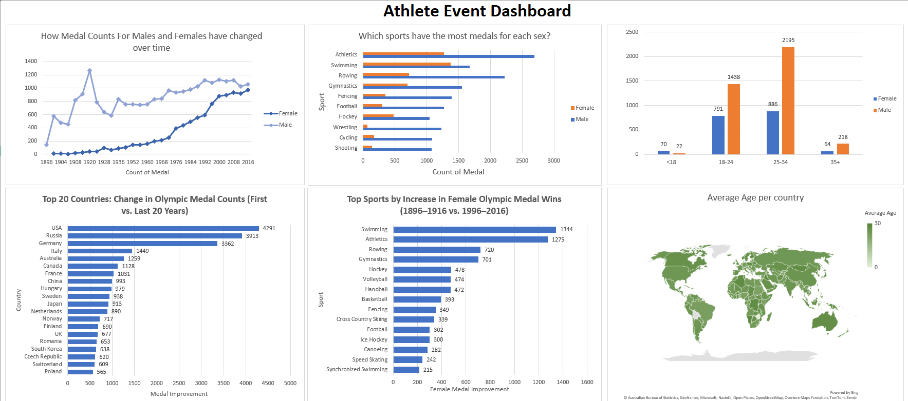
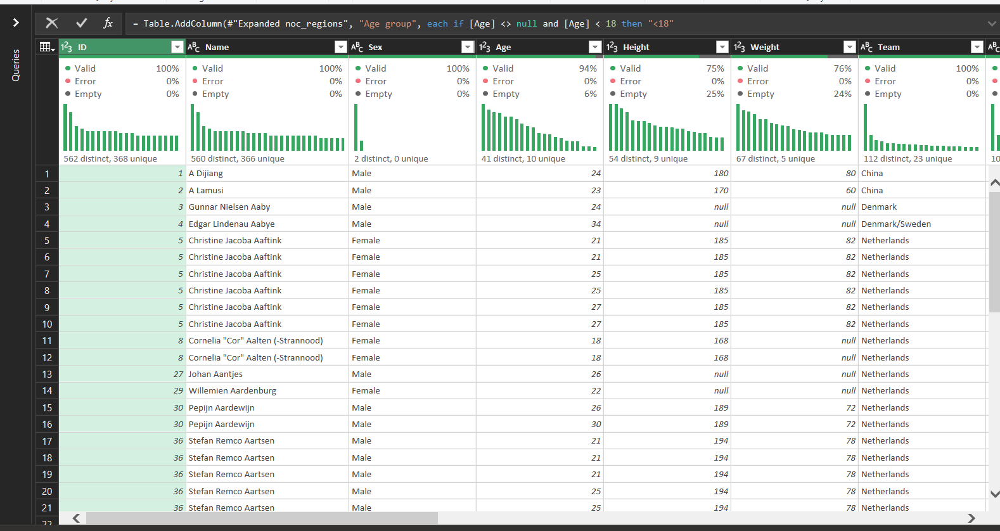
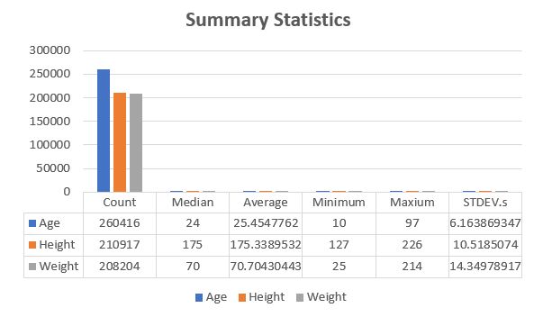
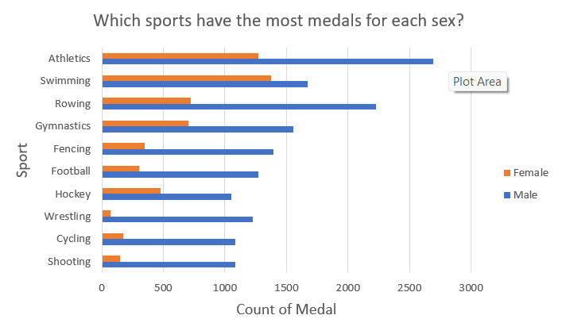
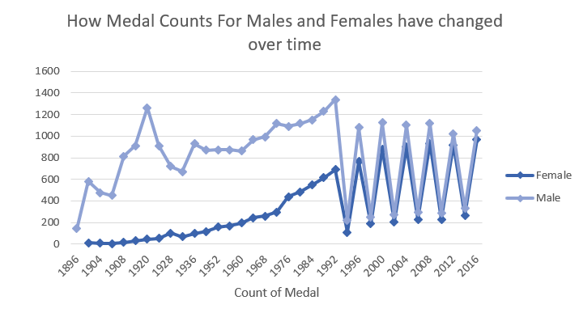
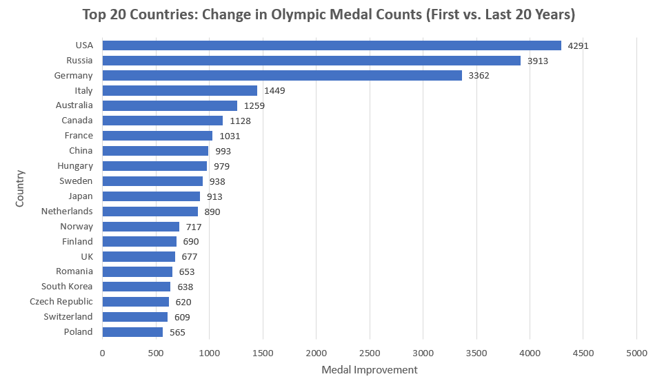
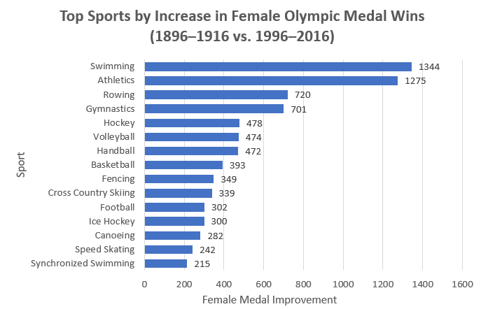
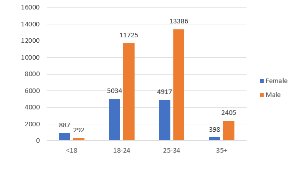
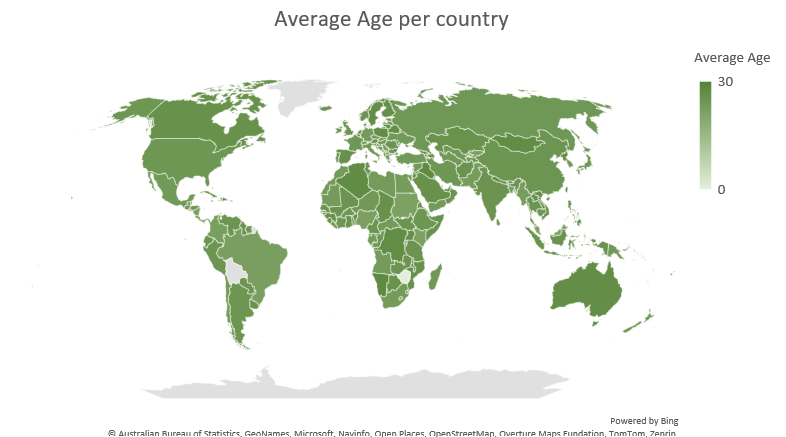

# Olympic Athlete Events Data Analysis

This project explores and analyzes 120 years of Olympic history using Excel and Power Query. The goal is to demonstrate a full data analysis workflow, from data cleaning to advanced business insights, with clear visualizations and a professional dashboard.

---

## 📂 Dataset

- **Source:** [Kaggle - 120 years of Olympic history: athletes and results](https://www.kaggle.com/datasets/heesoo37/120-years-of-olympic-history-athletes-and-results)
- **Files Used:**  
  - `athlete_events.csv`  
  - `noc_regions.csv`

---

## 🛠️ Process Overview

### 1. Data Cleaning

- **Standardized missing values:** Replaced all missing values with blanks for consistency.
- **Removed duplicates:** Identified and deleted 1,385 duplicate rows.
- **Checked data types:** Ensured columns like Age, Height, and Weight were numeric.
- **Merged country names:** Joined `noc_regions.csv` to add country names to each athlete record.



---

### 2. Exploratory Data Analysis (EDA)

#### 2.1 Summary Statistics

- Calculated count, mean, median, min, max, and standard deviation for Age, Height, and Weight.
- Visualized summary statistics with column charts.



#### 2.2 Medal Analysis by Sex and Sport

- Built PivotTables and bar charts to compare medal counts by sex across top sports.



#### 2.3 Time Trends

- Analyzed how medal counts for males and females changed over time using line charts.



---

## 3. Business Questions & Insights

---

#### Q1: Which countries have shown the greatest improvement in total medal counts between the first and last 20 years?

**DAX Measures Used:**

```DAX
First20_Medals :=
CALCULATE(
    COUNTROWS(athlete_events_with_country),
    athlete_events_with_country[Year] >= 1896,
    athlete_events_with_country[Year] <= 1916,
    athlete_events_with_country[Medal] <> "NA"
)

Last20_Medals :=
CALCULATE(
    COUNTROWS(athlete_events_with_country),
    athlete_events_with_country[Year] >= 1996,
    athlete_events_with_country[Year] <= 2016,
    athlete_events_with_country[Medal] <> "NA"
)

Medal_Improvement :=
[Last20_Medals] - [First20_Medals]
```



---

#### Q2: Which sports have seen the largest increase in female participation (measured by medal wins) from the earliest to the most recent 20 years?

**DAX Measures Used:**

```DAX
First20_Female_Medals :=
CALCULATE(
    COUNTROWS(athlete_events_with_country),
    athlete_events_with_country[Year] >= 1896,
    athlete_events_with_country[Year] <= 1916,
    athlete_events_with_country[Sex] = "Female",
    athlete_events_with_country[Medal] <> "NA"
)

Last20_Female_Medals :=
CALCULATE(
    COUNTROWS(athlete_events_with_country),
    athlete_events_with_country[Year] >= 1996,
    athlete_events_with_country[Year] <= 2016,
    athlete_events_with_country[Sex] = "Female",
    athlete_events_with_country[Medal] <> "NA"
)

Female_Medal_Improvement :=
[Last20_Female_Medals] - [First20_Female_Medals]
```



---

#### Q3: Which age group has won the most medals overall, and how does this differ between male and female athletes?

**Power Query Custom Column (for Age Grouping):**

```powerquery
if [Age] <> null and [Age] < 18 then "<18" 
else if [Age] <> null and [Age] >= 18 and [Age] < 25 then "18-24" 
else if [Age] <> null and [Age] >= 25 and [Age] < 35 then "25-34" 
else if [Age] <> null and [Age] >= 35 then "35+" 
else null
```

**DAX Measure for Medal Count:**

```DAX
MedalCount :=
CALCULATE(
    COUNTROWS(athlete_events_with_country),
    athlete_events_with_country[Medal] <> "NA"
)
```



---

#### Q4: Which countries have the highest average age of medal-winning athletes, and how does this compare between Summer and Winter Olympics?

**DAX Measure for Average Age:**

```DAX
Average_Age :=
CALCULATE(
    AVERAGE(athlete_events_with_country[Age]),
    athlete_events_with_country[Medal] <> "NA"
)
```

- Used a slicer or filter for Season (Summer/Winter) as needed.



---

## 📊 Final Dashboard

A comprehensive Excel dashboard brings together all key insights, including:
- Medal trends over time
- Medal distribution by sport and sex
- Age group analysis
- Country improvements
- Female participation growth
- Geographic patterns


---

## 📝 Key Learnings

- **Data cleaning** is crucial for reliable analysis.
- **PivotTables, Power Query, and Power Pivot** enable advanced Excel analytics.
- **Visual storytelling** helps communicate insights clearly.
- Tackling real business questions demonstrates practical data analysis skills.

---

## 💼 About

This project is part of my data analytics portfolio.  
Feel free to explore the code, workflow, and dashboard!