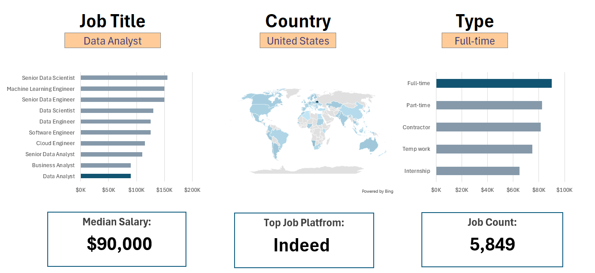
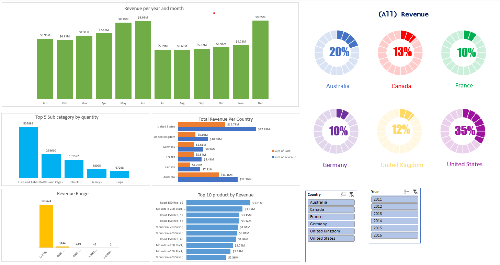

# Project Summaries

## Salary Dashboard Project

This project provides a comprehensive analysis of salaries for data-related roles, helping job seekers evaluate compensation for various positions. It uses real-world data science job listings from 2023, including job titles, salaries, locations, and key skills. The dashboard demonstrates Excel skills such as charts, formulas, and data validation to visualize and analyze the data.

[Go to Salary Dashboard Project](./Salary_Dashboard-Project%201/)

## Sales Dashboard Project

This project showcases advanced Excel skills through data cleaning, analysis, and the creation of an interactive sales dashboard using the `Sales.xlsx` dataset. It covers data transformation, pivot tables, and data visualization. The dashboard analyzes revenue trends, annual revenue distribution, and highlights top product sub-categories by sales volume.

[Go to Sales Dashboard Project](./Sales%20Dashboard/)

## Analysis - Project 2

This project explores the data science job landscape to identify valuable skills and their impact on salary potential. It addresses questions such as whether possessing more skills leads to higher pay, regional salary variations, and the most in-demand skills. The analysis uses Excel features like pivot tables, pivot charts, DAX, Power Query, and Power Pivot, based on real-world data science job listings from 2023.

[Go to Analysis - Project ](./Analysis-Project%202/)
