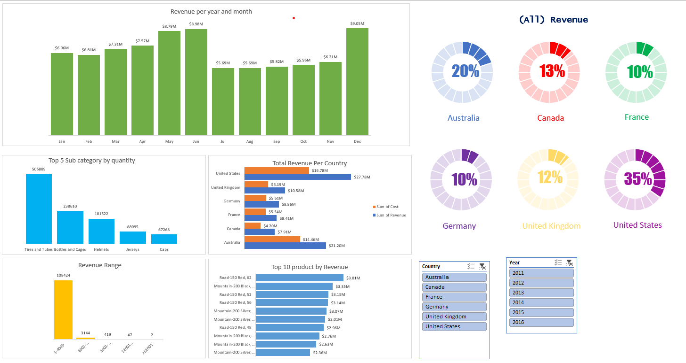

# Sales Dashboard Project

## Overview
This project demonstrates advanced Excel skills through comprehensive data cleaning, analysis, and interactive dashboard creation using the `Sales.xlsx` dataset. The primary objective is to master and showcase key Excel functionalities, including data transformation, pivot tables, and data visualization.

## Dataset
The dataset (`Sales.xlsx`) contains the following columns:
- Date
- Day
- Month
- Year
- Customer_Age
- Age_Group
- Customer_Gender
- Country
- State
- Product_Category
- Sub_Category
- Product
- Order_Quantity
- Unit_Cost
- Unit_Price
- Profit
- Cost
- Revenue

## Data Cleaning
- Removed duplicates and handled missing values to ensure data integrity.
- Standardized data formats (dates, text, and numerical values).
- Validated and corrected inconsistent entries across categorical fields.

## Data Analysis & Dashboard
Using Excel's Pivot Tables and advanced charting tools, the following analyses and visualizations were created:

- **Revenue per Year and Month:**
  - Visualized monthly revenue trends to identify seasonality and growth patterns.
- **Revenue per Year (Percentage):**
  - Displayed annual revenue distribution as percentages for comparative analysis.
- **Top 5 Sub-Categories by Quantity:**
  - Highlighted the most popular product sub-categories based on sales volume.
- **Total Revenue per Country:**
  - Compared revenue and cost across different countries to identify key markets.
- **Revenue Range:**
  - Analyzed the distribution of revenue across defined ranges to spot outliers and trends.
- **Top 10 Products by Revenue:**
  - Identified the highest-grossing products to inform business strategy.

## Excel Skills Demonstrated
- Data cleaning and transformation
- Pivot table creation and customization
- Advanced charting (bar, column, donut, and range charts)
- Interactive dashboard design
- Data-driven decision making

## Purpose
The purpose of this project is to master and demonstrate advanced Excel skills, focusing on real-world data analysis and dashboard creation. This project serves as a portfolio piece to showcase proficiency in Excel for data analytics.

